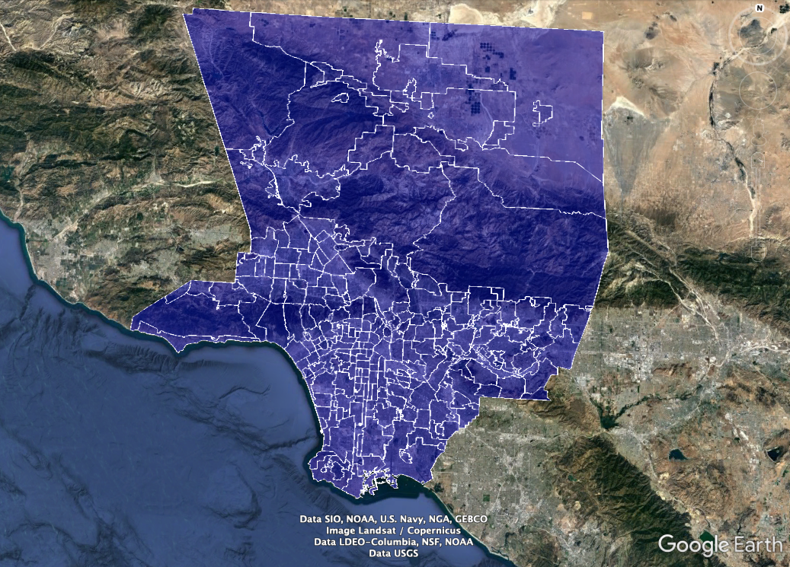

## Introduction

This assignment is going to use the principles of energy balance to examine how changing properties of urban environments alter the temperature of urban landscapes. In urban areas, the distribution of materials such as asphalt and concrete has been shown to lead to higher air temperatures compared to rural counterparts. This is known as the urban heat island (UHI) effect. High temperatures can be harmful to the health of residents, and in order to mitigate the UHI cities adopt strategies like increasing tree cover to increase shade and cooling, or increasing the reflectivity, also called albedo, with white paint. However, these strategies are not always evenly distributed throughout a city and may create environmental inequity. Read more about this phenomena [here](https://docs.google.com/document/d/1NUJATMo7KnmC3PpyFRdxo9HWH0F-zQxUDKiIW6pX7pY/edit#heading=h.z1slrwcvefnj).


We've assembled a dataset that captures a snapshot of average midday temperatures in August, the amount of vegetation, and a host of social/economic data across each neighborhood in the county of Los Angeles. The temperature data is from the Landsat satellite’s surface thermal data and was acquired in the Spring (April) and Summer (August) of 2020. The vegetation data is characterized by the Normalized Difference Vegetation Index (NDVI), and is taken from similar dates. [NDVI](https://earthobservatory.nasa.gov/features/MeasuringVegetation/measuring_vegetation_2.php) is a measure of “greenness” and higher values of NDVI indicate a greater amount of green vegetation within each neighborhood. The neighborhood information is collated
from the incredibly awesome Mapping LA project developed by the [LA Times](http://maps.latimes.com/neighborhoods), which is worth checking out. See a description of each column in the dataset at this [link](https://docs.google.com/spreadsheets/d/1Hh-hMt5RuXA3lBYX8G16T3334zXQfbFnJzCxh3qbDsw/edit?usp=sharing). For a visual reference of the LA times project, here is a map of the area of the LA basin and the neighborhoods:
{width=75%} 

***Note If the photo above does not show, you need to set your working directory. In the menu at the top, click "Session" -> "Set Working Directory," and navigate to the "Assignment1_forStudents" folder.

```{r setup, include=FALSE}
knitr::opts_chunk$set(echo = TRUE)
library(tidyverse)
library(rootSolve)
library(raster)
library(rgdal)
```


### Part I: Exploring Los Angeles County Data

In this assignment, we'll be exploring surface temperatures of different neighborhoods in Los Angeles County. To get a better idea of the spatial patterns within the county, check out the plot below. While the data we will use for analysis will be a finer spatial resolution, we include this just to give you a visual.


```{r map, echo=F, message = F, warning=F}
# load shapefile - this contains map of neighborhoods
# comment this out when giving them the Rmd
losang <- shapefile("../CPT/data/ESM203_F2020_Ass1.shp")

# view spatially averaged temperature 
spplot(losang, 'TEMP_SUMME', main="Mean August 2020 Temperature")

# to view the spatial data, uncomment and run the code below. this is optional and if you get errors, just comment out when knitting the file.
# library(mapview)
# mapview(losang)

```

#### Observations 

Lets start by just exploring our data. One of the first things we'd want to explore is what data is there. Run the code below to load the data and output the column names of all the data. 

```{r data_overview, message=F}
# load in data as a CSV 
LA_nbhds <- read.csv("../CPT/data/ESM203_F2020_Ass1.csv")

# output column names
colnames(LA_nbhds)
```

These column names tell us which variables are included in the data set.

Lets say you spent the evening playing around with the data looking for trends. Ideally we'd have a hypothesis in mind that we wanted to test, but sometimes in science you get lucky and stumble upon your hypothesis. So you were plotting variables (column names) against each other to see if there were any obvious correlations.

#### What are trends?
When we're plotting data we're looking for a relationship between two variables. Below are three different correlations we could expect. 
We have a positive correlation if Y increases with X , we have a negative correlation if Y decreases with X, and a seemingly randomly distribution of points indicates no correlation. At times correlations can be hard to detect so we will add a trend line and use statistics. [Here](https://infogram.com/blog/scatter-plots/) is a short description.

  


#### Summer NDVI v. surface temperatures

So in our exploration, one of the plots we made was mean August surface temperature against NDVI. We notice that this trend looks somewhat promising, and decide to plot a trend line. Do this by running the chunk below.  

```{r ndvi_plot, message=F}

LA_nbhds %>% 
  dplyr::filter(NDVI_SUMMER > 0 & NDVI_SUMMER < 1) %>% 
  ggplot() + geom_jitter(aes(x=NDVI_SUMMER, y=TEMP_SUMMER)) + 
  geom_smooth(aes(x=NDVI_SUMMER, y=TEMP_SUMMER), method=lm) + 
  labs(x = "August NDVI", y="August Temperature (deg C)") +
  ggtitle("Mean August 2020 surface temperature and NDVI of LA County")

```

##### Answer these questions:

1. Describe the relationship between August 2020 Mean Temperature and NDVI

> Leaving the arrow (>), delete this text and write your answer here

2. What might be some possible explanations as to why this relationship exists? There's no right answer here, go wild with it. 

> Leaving the arrow (>), delete this text and write your answer here

3. Now based upon your explanation form a single statement here, which we will use the model to test. This is your hypothesis. There is no "right answer," so please dont go back and change this.

> Leaving the arrow (>), delete this text and write your answer here


### Part II: Understanding the surface energy balance model

We're going be using equations throughout this class, so lets learn how to become more literate in equations. To do this we're going to explain the components and then draw a conceptual model. This may take some time, but its an extremely important skill. So take a deep breath, be patient with yourself, and dive in. 

Here is the somewhat simplified equation we will be using, based off of the equation on page 211 of Chapter 7 in Ecological Climatology by Bonan.


$$(1 - \alpha)S_{\downarrow} + L_{\downarrow} = L_{\uparrow} + H + \lambda E + G$$

##### Answer these questions:

Define each of the terms of the equation and include one sentence of what the flux is in plain language. If you need a hint, check out the chapter on [Surface Energy Fluxes](https://gauchospace.ucsb.edu/courses/pluginfile.php/10694510/mod_resource/content/2/Reading%20for%20Surface%20Energy%20Balance.pdf).


4. $(1 - \alpha)S_{\downarrow}$

> Leaving the arrow (>), delete this text and write your description here

5. $L_{\downarrow}$

> Leaving the arrow (>), delete this text and write your description here

6. $L_{\uparrow}$

> Leaving the arrow (>), delete this text and write your description here

7. $H$

> Leaving the arrow (>), delete this text and write your description here

8. $E$

> Leaving the arrow (>), delete this text and write your description here

9. $G$ We will be ignoring G for this assignment, but still define it

> Leaving the arrow (>), delete this text and write your description here

10. Now describe the full equation in no more than three sentences

> Leaving the arrow (>), delete this text and write your description here.


11. Draw a conceptual model of the equation from above, showing each of the fluxes going in and out of the surface. If you're unsure what a conceptual model is please reference the slides or google it, and a hint: you've seen the conceptual model you should be drawing before. 

To insert your conceptual model into this document: create a conceptual model by hand or on the computer and then turn it into a .jpg, or any photo file type. Include that photo in the assignment folder, and then use this code as a template to add it to this document: ``


### Part III: Solving for surface temperature 

The chunk below consists of functions needed to do the assignment. No need to change or do anything here, just run this chunk so the equations can be used later. 
```{r functions}
# the following functions are needed to solve the surface energy balance and calculate latent heat 

# Tetens eq. to solve for saturated vapor pressure (used in LE eq.)
sat_vp <- function(T){
  e <- 0.61078*exp(17.27*T/(T+237.3))
  return(e)
}

# surface energy balance returns surface temperature
# input is surface temperature, represented as x (in celsius)
# veg represents % veg cover, alpha is albedo, and eps is emissivity 
seb <- function(x, veg=0, alpha=0.15, eps=0.95){ 
  r_w = 1/(veg*50) # scaler for veg 
  L_inc = 0.9*sigma * (T_a+273.15)^4  # incoming longwave radiation [W/m^2]
  R_av = (K_inc*(1-alpha) + L_inc) # net available energy at surface [W/m^2] 
  L_out = eps*sigma*(x+273.15)^4 # outgoing longwave radiation [W/m^2]
  H = 1.15*1005*(x-T_a)/r_H # sensible heat flux [W/m^2]
  E = 1.15*1005/66.5*(sat_vp(x) - sat_vp(T_a))/r_w # latent heat flux [W/m^2]
  val = - R_av + L_out + H + E
  return(val)
}

## returns bar plot of the different fluxes
plot_fluxes <- function(veg_cov){
  alpha=0.2
  range=c(1,100)
  x <- uniroot.all(seb, range, veg=veg_cov, alpha=0.2)
  r_w = 1/(veg_cov*50) # scaler for veg
  L_inc = 0.9*sigma * (T_a+273.15)^4  # incoming longwave radiation [W/m^2]
  R_av = (K_inc*(1-alpha) + L_inc) # net available energy at surface [W/m^2] 
  L_out = eps*sigma*(x+273.15)^4 # outgoing longwave radiation [W/m^2]
  H = 1.15*1005*(x-T_a)/r_H # sensible heat flux [W/m^2]
  E = 1.15*1005/66.5*(sat_vp(x) - sat_vp(T_a))/r_w # latent heat flux [W/m^2]
  fluxes <- data.frame(flux=c("R_av","L_out","H","E"), value=c(R_av,L_out,H,E))
  fluxes$flux <- factor(fluxes$flux, levels=c("R_av", "L_out", "H","E"))
  plot <- ggplot(fluxes) + geom_col(aes(x=flux, y=value, fill=flux)) +
    ylab("energy [W/m^2]")
  return(plot)
}

```

In order to use this equation to test our hypothesis we are going to do a sensitivity analysis. To perform this, we vary one parameter at a time and observe how the output changes, which in this case is temperature. We're first going to do an example together, and then you'll do one on your own.

#### Albedo

We learned in class that albedo affects the amount of shortwave radiation entering the surface by reflecting some back. Albedo affects the available energy at the surface, which we will call $R_{av}$, through the equations:

$$S_{net} = S_{\downarrow}*(1-\alpha)$$ 

$$R_{av} = S_{net} + L_{\downarrow}$$


Where $\alpha$ represents albedo. Use the code below to explore the model outcomes, and to answer the questions below. 

The following are other variables needed to use the model. No need to change these.  
```{r vars}
eps = 0.95 # surface emissivity
T_a = 28 # ambient atm temp in Celsius 
sigma = 5.6704*10^-8 #W/m^2/K^4 stefan-boltzmann constant
r_H = 20 # Sensible heat resistivity
K_inc = 800 # W/m^2, incoming shortwave radiation
```

This chunk runs the model, outputs the steady state temperature, and displays the graph of the sensitivity analysis.
```{r solve}
## Run the below code to solve for surface temperature
# temp_s is surface temperature
range = c(0,100)
test_albedo <- function(x){
  temp_s = uniroot.all(seb, range, alpha=x)
  return(temp_s)
}

# You can solve for surface temp by inputting specific values of albedo, where x is albedo - replace x with any value between 0 and 1. 
test_albedo(x=0.9)

# The code below runs the above function for every value of albedo in the 'alpha' vector below
# quick SA for veg parameter 
alpha <- seq(0,1, by=0.05)
test <- sapply(X=alpha, FUN=test_albedo)
# combine input and output 
albedo_df <- data.frame(alpha, test)
# plot data frame (do this together in discussion)
ggplot(albedo_df) + geom_point(aes(x=alpha, y=test)) + 
  labs(x="albedo", y="surface temperature (deg C)")

```

##### Answer these questions:

12. What happens to the surface temperature when albedo increases?

> Leaving the arrow (>), delete this text and write your answer here

13. Think about a roof made of asphalt and a roof that has been painted white. Which would have a higher albedo?

> Leaving the arrow (>), delete this text and write your answer here

14. Which would have a higher surface temperature?

> Leaving the arrow (>), delete this text and write your answer here


#### Vegetation

Now its your turn do a sensitivity analysis based upon the amount of vegetation, but first we dive a little deeper into the latent energy equation. 

Remember that we defined latent energy as:

$$\lambda E \propto \frac{\Delta e}{r_W}$$
##### Answer these questions:

15. Define $\Delta e$

> Leaving the arrow (>), delete this text and write your answer here

16. Define $r_W$

> Leaving the arrow (>), delete this text and write your answer here

17. What happens to $lambda E$ when $\Delta e$ increases?

> Leaving the arrow (>), delete this text and write your answer here

18. What happens to $lambda E$ when $r_W$ increases?

> Leaving the arrow (>), delete this text and write your answer here


In reality, as we've seen in the reading, this equation is a bit more complicated. For now, dont get too stuck on this. We only include it to elaborate on the actual equations you are using.

$$\lambda E = -\frac{\rho*C_p}{\gamma}*\frac{e_a - e_{*}[T_s]}{r_W}$$

Where $-\frac{\rho*C_p}{\gamma}$ represents the density of water, specific heat capacity, and the psychrometric constant, which depends on the heat capacity, atmospheric pressure, and latent heat of vaporization.
The second part, $(e_a - e_{*}[T_s])$ is the gradient of vapor pressure between the atmosphere and the surface. The resistance to vapor transfer between the surface and the atmosphere is $r_W$. When this resistance is high, the rate of evaporation is low and when the resistance is low, the rate of evaporation is higher. All other things being equal, the resistance to vapor transport is determined by amount of **vegetated** surface. Of course, $r_W$ can change if vegetation becomes water-limited, or if the atmospheric conditions change. Check out [section 7.2](https://gauchospace.ucsb.edu/courses/pluginfile.php/10694510/mod_resource/content/2/Reading%20for%20Surface%20Energy%20Balance.pdf) to learn more. 

For this model, we will use the fraction of vegetation cover, called 'veg', to account for changes in the resistance to water vapor transport when vegetation is present. 

In the same way we did a sensitivity analysis for albedo, this chunk does a sensitivity analysis for vegetation. 
```{r veg_sa}
## Run the below code to solve for surface temperature
# temp_s is surface temperature
range = c(0,100)
test_veg <- function(veg){
  temp_s = uniroot.all(seb, range, veg=veg)
  return(temp_s)
}

# quick SA for veg parameter 
veg <- seq(0,1, by=0.05)
test <- sapply(X=veg, FUN=test_veg)
# copy and paste the code from the albedo testing above, then create a plot of veg vs. surface temperature  
veg_df <- data.frame(veg, test)
ggplot(veg_df) + geom_point(aes(x=veg, y=test)) + 
  labs(x="vegetation (%)", y="surface temperature (deg C)")

```


We have created a function that lets you plot the different energy fluxes based on the amount of vegetation. Use this tool to help conceptualize the results of your sensitivity analysis above. You can change the number in `plot_fluxes(veg=#)` to see how different amounts of vegetation affect the different major fluxes of the energy model. Copy and past the line to plot multiples of this plot.

```{r plot}
# plot_fluxes shows a bar plot of the different energy fluxes. Change veg between 0 to 1 to see how the latent and sensible energy change 
plot_fluxes(veg_cov=1)
```

##### Answer these questions:

19. How does the presence of vegetation affect the surface temperature? 

> Leaving the arrow (>), delete this text and write your answer here

20. Explain why this relationship occurs. Think back to the equation we had you describe.

> Leaving the arrow (>), delete this text and write your answer here

21. Does this relationship explain the initial graph between NDVI and temperature above (in the introduction)? Explain. Include a comment about you initial hypothesis as well.

> Leaving the arrow (>), delete this text and write your answer here


### Part IV: Connecting to socioeconomic data 

Remember the NDVI. v. temp plot above? Now it's your turn to explore the data set (`LA_nbhds`) and create your own plots. This is your turn to apply what you have learned and get creative. You can use anything you've learned from 206 so far to explore and summarize the data. Create at least one plot that includes NDVI or temperature on the x-axis, and a socio-economic variable on the y-axis. You can copy and paste the code from above, but also be creative! Then answer the reflection questions below. 
```{r socioeconomic}
## plot here
```


22. Based on your plot(s) what relationship exists? Write a short (1-2 paragraph max) reaction/response to your findings, focusing on what they imply for issues related to environmental management, planning, and/or environmental justice. While your response should refer to the specifics of your plots/presentation, you do not need to do an exhaustive analysis or find citations to support your inference.

> Leaving the arrow (>), delete this text and write your answer here

23. For this entire assignment: Share a thought or lesson that clicked for you. What was the most interesting part?

> Leaving the arrow (>), delete this text and write your answer here
